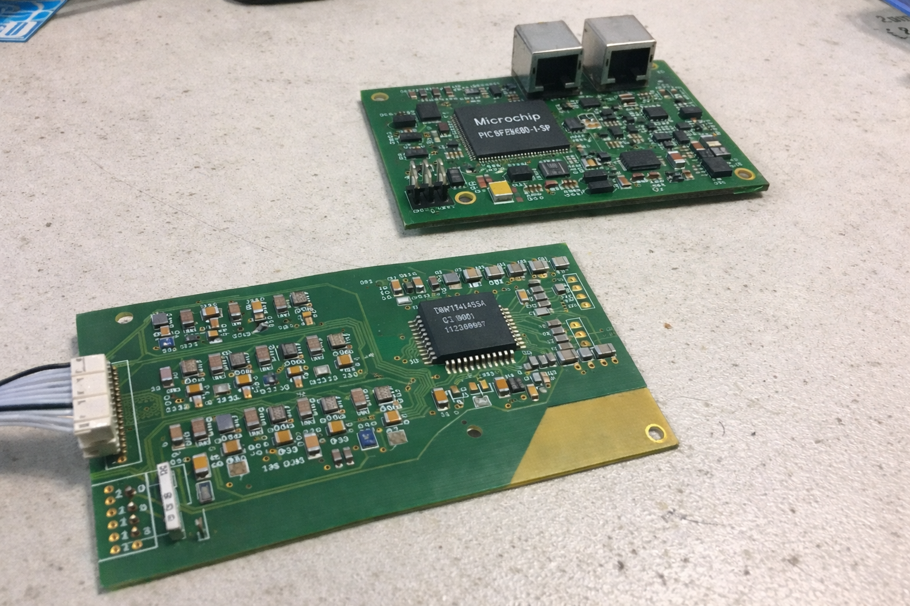
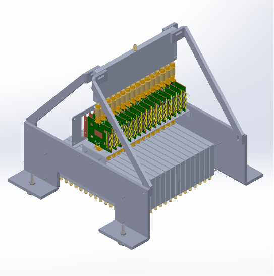
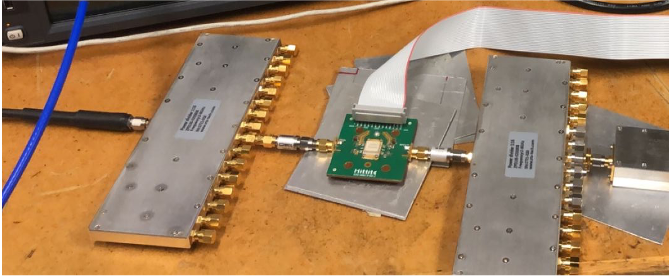

# Projects

  <article class="project-card">
    

      
    

    

      
Embedded Systems | Wireless Communications | LoRa

      <h3>Wireless IoT Water Leak Sensor</h3>
      
Designed and built a wireless water leak sensor as a reference design for clients

      <ul class="project-highlights">
        <li>Routed 4-layer PCB with Altium Designer then assembled and tested prototype.</li>
        <li>Wrote firmware in embedded C using FreeRTOS stack. Firmware implemented multipe tasks for communications, application layer and watchdog.</li>
        <li>Verified operation through bench measurments and confirmed +3 year battery life.</li>
      </ul>
      

        Embedded C
        FreeRTOS
        PCB Design
      

    

  </article>
  <article class="project-card">
    

      
    

    

      
Embedded Systems | Power Electronics

      <h3>Lithium-Ion Battery Management System</h3>
      
Designed and built a prototype BMS to monitor cell voltage, current, and temperature while balancing cells for safe operation.

      <ul class="project-highlights">
        <li>Created a master BMS board with four distributed sensing and balancing boards.</li>
        <li>Designed 4-layer PCBs in Altium and implemented embedded C firmware on a PIC microcontroller with a TI BMS chipset.</li>
        <li>Verified operation through breadboard testing and bench measurements.</li>
      </ul>
      

        Embedded C
        Battery Safety
        PCB Design
      

    

  </article>

  <article class="project-card">
    

      
      
    

    

      
M.Eng Capstone | RF Systems

      <h3>Microwave Breast Cancer Imaging Prototype</h3>
      
Contributed to a novel imaging research system that uses ultra-wideband microwave signals to detect cancerous tissue.

      <ul class="project-highlights">
        <li>Designed the signal distribution system for an 8x8 microstrip antenna array operating at 3-9 GHz.</li>
        <li>Built a SolidWorks fixture that supported the array and served as a heat sink for RF amplifiers.</li>
        <li>Designed a KiCad PCB for power distribution and RF switch control.</li>
      </ul>
      

        RF Systems
        PCB Design
        Embedded Control
      

    

  </article>

